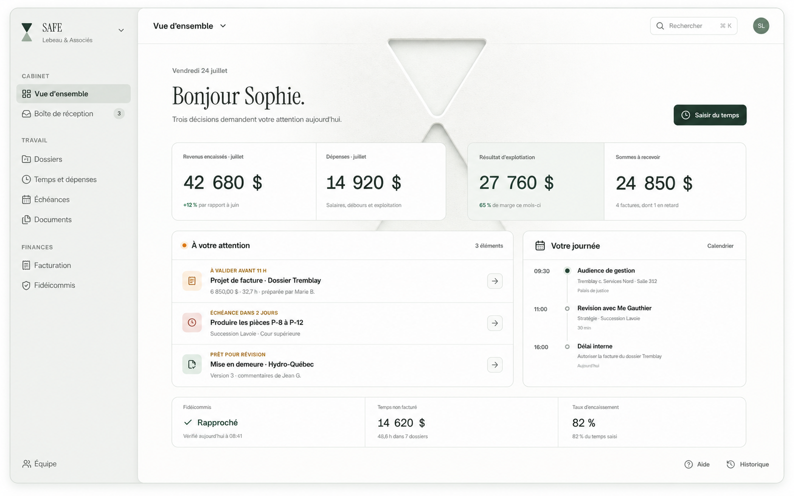

# SAFE Dashboard hybride

## Spécification de build pour Claude Code

> Statut : spécification visuelle à construire dans une route isolée.
>
> Cette interface ne doit pas remplacer ni modifier le tableau de bord SAFE en
> production avant une validation explicite.

## 1. Résultat attendu

Construire une version interactive et fidèle du tableau de bord illustré ci-dessous
pour l’avocat principal d’un cabinet.

L’écran doit permettre de comprendre en moins de 15 secondes :

1. la situation financière du cabinet ;
2. les décisions qui nécessitent une intervention ;
3. les rendez-vous et échéances de la journée ;
4. l’état du temps non facturé et du fidéicommis.

Le résultat doit ressembler à une application professionnelle réelle. Il ne doit pas
ressembler à une landing page, à un gabarit de dashboard générique ou à une interface
centrée sur l’IA.

## 2. Référence visuelle principale



Fichier source :
[`public/images/linear-style/safe-dashboard-hybrid-production-concept.png`](../../public/images/linear-style/safe-dashboard-hybrid-production-concept.png)

Cette capture définit :

- la composition générale ;
- la densité ;
- la hiérarchie typographique ;
- le retrait visuel de la sidebar ;
- la palette blanche, sauge et vert forêt ;
- la taille dominante des chiffres ;
- la structure des panneaux ;
- la texture gravée du grand logo central.

La capture ne définit pas correctement la géométrie ni la disposition finale du logo.
Les règles de la section 7 priment sur l’image pour ce point précis.

## 3. Contrainte de sécurité

### Route autorisée

Construire uniquement dans :

```text
/safe-linear-visual/dashboard
```

Fichiers de prototype autorisés :

```text
app/safe-linear-visual/dashboard/page.tsx
app/safe-linear-visual/safe-linear-visual.module.css
```

Des composants supplémentaires peuvent être créés sous :

```text
components/safe-linear-visual/
```

### Routes et composants interdits

Ne pas modifier, remplacer ou rediriger :

```text
/tableau-de-bord
app/(app)/tableau-de-bord/page.tsx
components/dashboard/DashboardViewSafe.tsx
components/dashboard/LawyerGlance.tsx
components/layout/Sidebar.tsx
```

Ne pas modifier Prisma, Supabase, les données de production, les permissions ou les
routes API pour cette phase.

Le prototype doit utiliser des données locales statiques clairement identifiées.

## 4. Sources de vérité obligatoires

Avant de coder, lire :

```text
CLAUDE.md
CO-DIRECTION.md
docs/design/DESIGN_HUMAIN.md
components/branding/SafeLogo.tsx
```

La voix de l’interface utilise « vous », jamais « tu ». Ne pas utiliser d’em-dash dans
le copywriting.

## 5. Architecture de l’écran

### 5.1 Cadre de l’application

- Application desktop plein écran.
- Fond extérieur presque blanc.
- Conteneur principal avec une bordure très fine, un rayon modéré et une ombre très
  légère.
- Sidebar en retrait avec un fond sauge grisé.
- Surface de travail blanche, légèrement plus lumineuse que la sidebar.
- Aucun glassmorphism.
- Aucun dégradé décoratif voyant.

### 5.2 Sidebar

Largeur cible : environ `255px` sur une maquette de `1586px`.

En-tête :

- logo SAFE officiel ;
- mot-symbole `SAFE` ;
- nom du cabinet `Lebeau & Associés` ;
- chevron discret de changement de cabinet.

Navigation :

```text
Cabinet
  Vue d’ensemble
  Boîte de réception                    3

Travail
  Dossiers
  Temps et dépenses
  Échéances
  Documents

Finances
  Facturation
  Fidéicommis
```

Pied de sidebar :

```text
Équipe
```

La sidebar doit sembler en retrait par rapport à la surface principale. Utiliser une
différence de fond et une séparation subtile, pas une grosse ombre.

### 5.3 Barre supérieure

À gauche :

```text
Vue d’ensemble
```

À droite :

- recherche ;
- raccourci `⌘ K` ;
- avatar de l’utilisateur `SL`.

### 5.4 En-tête exécutif

Copie :

```text
Vendredi 24 juillet

Bonjour Sophie.

Trois décisions demandent votre attention aujourd’hui.
```

Action principale :

```text
Saisir du temps
```

Le bouton est vert forêt, compact et aligné à droite. Il constitue l’action principale
de l’écran.

### 5.5 Indicateurs financiers

Afficher quatre colonnes dans un seul ensemble visuel.

| Indicateur | Valeur | Information secondaire |
|---|---:|---|
| Revenus encaissés · juillet | 42 680 $ | +12 % par rapport à juin |
| Dépenses · juillet | 14 920 $ | Salaires, débours et exploitation |
| Résultat d’exploitation | 27 760 $ | 65 % de marge ce mois-ci |
| Sommes à recevoir | 24 850 $ | 4 factures, dont 1 en retard |

Règles :

- Les montants sont les informations les plus grandes de l’écran.
- Utiliser des chiffres tabulaires.
- Les intitulés sont petits mais lisibles.
- Le résultat d’exploitation reçoit un fond sauge extrêmement léger.
- Les quatre colonnes appartiennent à un seul bloc, sans produire quatre cartes
  flottantes indépendantes.

### 5.6 Zone « À votre attention »

Le panneau de gauche contient trois décisions actionnables :

```text
À VALIDER AVANT 11 H
Projet de facture · Dossier Tremblay
6 850,00 $ · 32,7 h · préparée par Marie B.

ÉCHÉANCE DANS 2 JOURS
Produire les pièces P-8 à P-12
Succession Lavoie · Cour supérieure

PRÊT POUR RÉVISION
Mise en demeure · Hydro-Québec
Version 3 · commentaires de Jean G.
```

Chaque ligne possède :

- un signal coloré subtil ;
- une icône fonctionnelle ;
- un titre ;
- une métadonnée ;
- un bouton persistant permettant d’ouvrir le détail.

Ne pas cacher l’action uniquement au survol.

### 5.7 Zone « Votre journée »

Utiliser une timeline verticale :

```text
09:30
Audience de gestion
Tremblay c. Services Nord · Salle 3.12
Palais de justice

11:00
Révision avec Me Gauthier
Stratégie · Succession Lavoie
30 min

16:00
Délai interne
Autoriser la facture du dossier Tremblay
Aujourd’hui
```

Ajouter une action secondaire persistante :

```text
Calendrier
```

### 5.8 Bandeau opérationnel inférieur

Afficher trois cellules :

```text
Fidéicommis
Rapproché
Vérifié aujourd’hui à 08:41

Temps non facturé
14 620 $
48,6 h dans 7 dossiers

Taux d’encaissement
82 %
```

Ce bandeau doit rester secondaire par rapport aux quatre indicateurs financiers.

### 5.9 Actions de bas de page

À droite :

```text
Aide
Historique
```

Ces actions doivent rester visibles et alignées avec le bord inférieur de la surface
de travail.

## 6. Hiérarchie visuelle

Ordre de lecture recherché :

1. `Bonjour Sophie.`
2. les quatre chiffres financiers ;
3. les décisions à traiter ;
4. la journée ;
5. le bandeau opérationnel ;
6. les actions secondaires.

Ne pas donner le même poids visuel à tous les panneaux.

Éviter :

- les ombres uniformes sur toutes les cartes ;
- les gros rayons identiques partout ;
- les icônes décoratives ;
- le texte centré ;
- les graphiques artificiels sans donnée utile ;
- les couleurs saturées ;
- les effets « AI dashboard ».

## 7. Logo SAFE gravé

### 7.1 Source officielle

Ne jamais redessiner ou générer le logo.

Utiliser directement :

```tsx
import { ChevronMark } from "@/components/branding/SafeLogo";
```

Le tracé officiel est défini dans :

```text
components/branding/SafeLogo.tsx
```

Le symbole comprend deux galets asymétriques et convergents :

- le galet supérieur est plein ;
- le galet inférieur utilise environ `55 %` d’opacité ;
- les deux formes sont décalées diagonalement ;
- il ne s’agit pas de deux triangles symétriques.

Le logo de la sidebar doit également utiliser `ChevronMark`. Aucun PNG généré ou
symbole approximatif n’est accepté.

### 7.2 Aspect du grand logo

Le rendu visuel à reproduire est celui de la capture :

- gravure blanche sur blanche ;
- surface mate légèrement minérale ;
- biseau clair très fin ;
- ombre intérieure vert-gris très douce ;
- profondeur faible mais perceptible ;
- léger reflet sauge ;
- fondu progressif vers le bas.

Ce logo n’est pas :

- un watermark plat ;
- une illustration opaque ;
- une extrusion 3D brillante ;
- une image générée ;
- une paire de triangles génériques.

### 7.3 Position

- Centrer le logo dans la grande zone blanche de travail, sidebar exclue.
- Le centre horizontal est calculé par rapport à `.workspace`, pas au viewport complet.
- Conserver le logo derrière le contenu avec `z-index: 0`.
- Placer le contenu interactif à `z-index: 1`.
- Le logo peut être partiellement masqué par les panneaux opaques, comme une gravure
  présente dans le mur derrière l’interface.
- Il ne doit jamais passer visuellement au-dessus du texte ou des bordures.
- Son fondu inférieur doit éviter une coupure nette.

Structure recommandée :

```tsx
<div className={styles.dashboardEngraved} aria-hidden="true">
  <span className={styles.embossHighlight}>
    <ChevronMark size={430} tone="mono-light" animate={false} />
  </span>
  <span className={styles.embossShadow}>
    <ChevronMark size={430} tone="light" animate={false} />
  </span>
  <span className={styles.embossFace}>
    <ChevronMark size={430} tone="light" animate={false} />
  </span>
</div>
```

Construire l’effet avec des couches CSS du même SVG :

- couche claire décalée de `-2px` à `-4px` ;
- couche d’ombre décalée de `3px` à `6px` ;
- couche de face presque transparente ;
- `mask-image` vertical pour le fondu inférieur.

Ne pas utiliser ImageGen pour cette étape.

## 8. Responsive

### Desktop large

- Conserver les quatre KPI sur une rangée.
- Panneaux inférieurs en grille asymétrique.
- Sidebar complète.

### Tablette

- Réduire la sidebar ou permettre son repli.
- Passer les KPI sur deux colonnes si nécessaire.
- Conserver toutes les actions essentielles visibles.
- Le logo gravé doit rester derrière le contenu sans réduire le contraste.

### Mobile

Cette maquette n’est pas conçue pour être simplement compressée.

- Navigation dans un tiroir.
- KPI en liste ou en grille de deux.
- Timeline sous les décisions.
- Aucun comportement dépendant uniquement du survol.

## 9. Accessibilité

- Contraste WCAG AA pour tout texte utile.
- Logo gravé décoratif avec `aria-hidden="true"`.
- Boutons avec libellés accessibles.
- Focus clavier visible.
- Zones interactives d’au moins `40px` sur tablette.
- Ne pas utiliser uniquement la couleur pour exprimer un statut.
- Respecter `prefers-reduced-motion`.

## 10. Données et future intégration

Dans cette phase isolée, utiliser les données statiques de la capture.

La future intégration pourra connecter les champs existants de
`app/(app)/tableau-de-bord/page.tsx` :

- `kpis` ;
- `alerts` ;
- `activityFeed` ;
- `trustBalance` ;
- `upcomingTasks` ;
- `upcomingEvents` ;
- `readyForReviewSignals`.

Ne pas effectuer cette connexion pendant le build du prototype.

Conserver plus tard :

- les permissions par rôle ;
- le périmètre personnel de l’avocat ;
- les obligations de fidéicommis ;
- les états d’onboarding ;
- la Navette et les éléments prêts pour révision.

## 11. Comportements

Pour le prototype :

- `Saisir du temps` peut ouvrir un panneau local factice ;
- les lignes de décision peuvent avoir un état de sélection local ;
- `Calendrier`, `Aide` et `Historique` peuvent ouvrir des panneaux de démonstration ;
- aucune action ne doit écrire dans la base de données ;
- aucun appel API métier n’est nécessaire.

Les interactions doivent être sobres :

- transition de `160ms` à `220ms` ;
- déplacement maximal de quelques pixels ;
- aucun rebond ;
- aucun halo ;
- aucune animation décorative permanente.

## 12. Checklist de validation

### Isolation

- [ ] La route `/tableau-de-bord` n’a pas été modifiée.
- [ ] Aucun composant de production n’a été remplacé.
- [ ] Aucune donnée réelle n’est écrite.
- [ ] Le prototype fonctionne directement sur `/safe-linear-visual/dashboard`.

### Fidélité visuelle

- [ ] La sidebar paraît en retrait.
- [ ] Les revenus et dépenses dominent l’écran.
- [ ] Les quatre KPI forment un seul bloc.
- [ ] Les décisions sont plus importantes que la timeline.
- [ ] Le bandeau opérationnel reste secondaire.
- [ ] Le bas de l’application est entièrement visible.

### Logo

- [ ] Le logo de la sidebar utilise `ChevronMark`.
- [ ] Le logo central utilise exactement le même tracé officiel.
- [ ] Aucun triangle générique ou logo généré n’est présent.
- [ ] Le logo central est centré par rapport à la zone de travail.
- [ ] Le relief ressemble à une gravure dans un mur mat.
- [ ] Le logo reste derrière les panneaux et le texte.
- [ ] Le fondu inférieur est progressif.

### Qualité

- [ ] L’écran a une intention principale claire.
- [ ] Le contenu est concret et non générique.
- [ ] Les actions essentielles ne dépendent pas du survol.
- [ ] Les contrastes sont lisibles.
- [ ] Les états clavier sont visibles.
- [ ] La checklist §10 de `DESIGN_HUMAIN.md` est passée.

## 13. Vérification avant livraison

Exécuter :

```bash
npm run build
```

Puis vérifier visuellement :

```text
http://localhost:3001/safe-linear-visual/dashboard
```

Tester au minimum :

- un écran desktop large ;
- un écran laptop ;
- une largeur tablette ;
- le focus clavier ;
- `prefers-reduced-motion`.

Livrer :

1. la liste des fichiers créés ou modifiés ;
2. une capture desktop de la route isolée ;
3. le résultat de la compilation ;
4. les écarts restants par rapport à la référence ;
5. la confirmation explicite que la production n’a pas été remplacée.

## 14. Définition de terminé

Le travail est terminé lorsque le prototype interactif correspond visuellement à la
capture, utilise les véritables logos SAFE, fonctionne sur la route isolée, passe le
build et ne modifie aucun écran de production.
